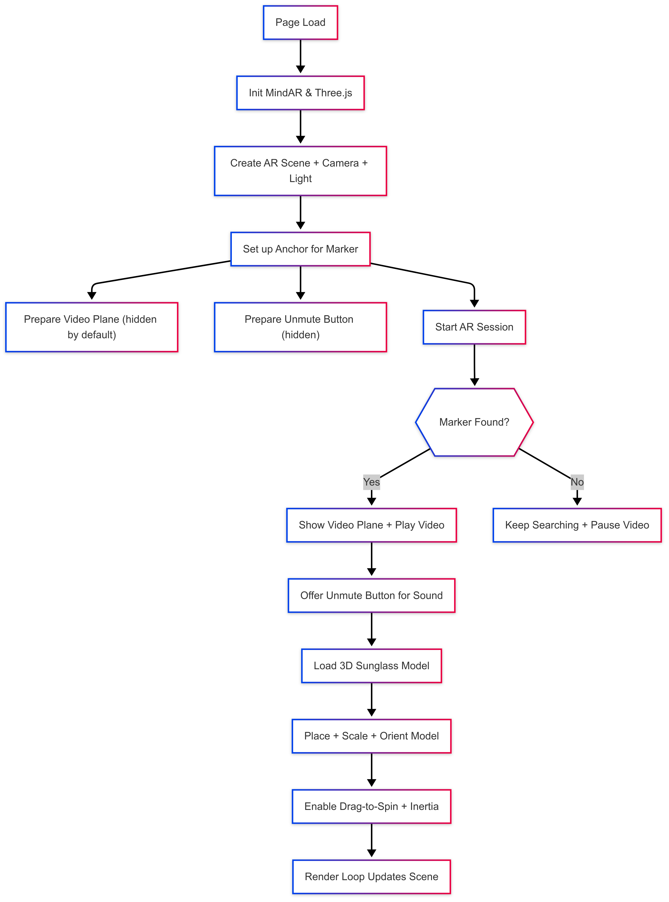
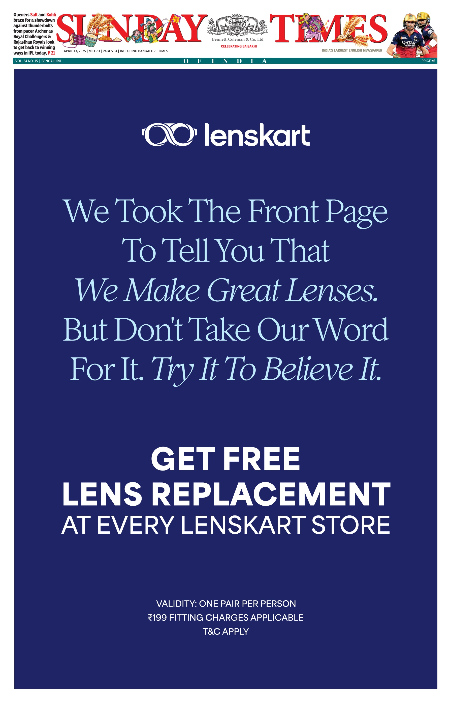

# 🕶️ WebAR Sunglass Experience


This project demonstrates a **WebAR application** that combines a marker-based AR experience with video playback and an interactive 3D sunglass model. Built using [MindAR](https://hiukim.github.io/mind-ar-js-doc/) (which bundles Three.js under the hood), the app overlays video and 3D models on a printed marker — in this case, the provided **Lenskart newspaper ad cutout**.

👉 **[Try the Live Demo here](https://roshit-omanakuttan.github.io/newspaper-webar/)**  

---

## 🚀 What’s Built

- **Marker-based WebAR**: Uses the `sunglass.mind` image target to detect the paper cutout marker.  
- **Video Integration**: A background video plays behind the 3D model when the marker is detected.  
- **Audio UX Handling**: Autoplays muted video, with an **Unmute button** to comply with browser policies.  
- **3D Sunglass Model**: Loads a `.glb` asset, scaled, oriented, and placed above the marker.  
- **Interactive Controls**: Drag-to-spin functionality with inertia for natural model rotation.  
- **Depth Fixes**: Ensures the sunglass model always appears in front of the video (avoiding z-fighting).  

---

## 🛠️ How It’s Built

1. **Initialization**
   - Load MindAR (Image tracking) + Three.js r128.
   - Create AR scene, camera, and hemisphere light.

2. **Anchor Setup**
   - Define an anchor for the first target in `sunglass.mind`.
   - Attach AR content (video plane + 3D model) to this anchor.

3. **Video Plane**
   - Create a `<video>` element with autoplay, muted, and looping enabled.
   - Use `THREE.VideoTexture` and `MeshBasicMaterial` with `depthWrite: false`.
   - Plane is hidden until marker is found.

4. **Unmute Handling**
   - Show “🔊 sound on” button when marker is found and video is playing.
   - Allow user to unmute on demand.

5. **3D Model**
   - Load `.glb` model using `GLTFLoader` (with optional DRACO support).
   - Scale, orient, and position above marker.
   - Enable depth test while ensuring correct render order.

6. **Drag-to-Spin Interaction**
   - Track pointer/touch events on `#ar` container.
   - Rotate model based on drag delta.
   - Add inertia (velocity decay) for smooth spinning.

7. **AR Loop**
   - Start AR session with `mindarThree.start()`.
   - Continuous render loop updates scene.

---

## 🔄 Data Flow Diagram

Below is the high-level flow of the app:



---

## 📰 Testing with Paper Cutout

To test this WebAR experience:

1. **Print or keep the cutout handy**  
   Use the included marker image:  
   

2. **Run locally (optional)**  
   - Clone this repo and serve it locally:
     ```bash
     git clone <your-repo-url>
     cd newspaper-webar
     npx http-server .
     ```
   - Open in browser: `http://localhost:8080`

3. **Use the Hosted Demo**  
   👉 [Live Demo](https://roshit-omanakuttan.github.io/newspaper-webar/)  

4. **Point Camera at Marker**  
   - Open the app on a phone or webcam-enabled browser.  
   - Point it at the **paper cutout marker**.  
   - The video should start behind the sunglasses, and the 3D sunglass model should appear on top.  

5. **Interact**  
   - Drag the model to spin it.  
   - Tap the “🔊 sound on” button to unmute video audio.  

---

## 📂 Project Structure

```
.
├── index.html        # Main AR app
├── sunglass.glb      # 3D sunglass model
├── sunglass.mp4      # Background video
├── sunglass.mind     # MindAR image target (marker definition)
├── flowchart.png     # App data flow diagram
├── paper-cutout.jpg  # Test cutout marker (newspaper ad)
```

---

## ✅ Next Steps

- Replace `sunglass.glb` with your own 3D assets.
- Modify `sunglass.mp4` to play a custom campaign video.
- Train new `.mind` marker files for other images or brands.  

---

## 📜 License

This project is for **educational/demo purposes**.  
Check asset licenses before using in production.
